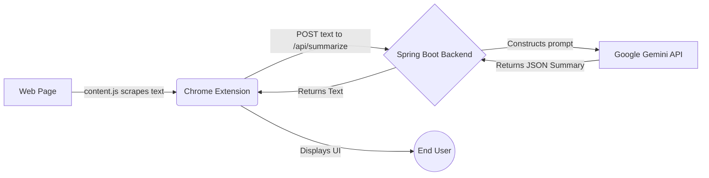

# Terms Summarizer - Project Report

## Overview
**Terms Summarizer** is a practical and user-friendly tool consisting of a Chrome Extension and a Spring Boot backend. Its core purpose is to extract lengthy and often complicated Terms & Conditions (T&C) or Privacy Policies from web pages and provide concise, readable summaries utilizing the **Google Gemini API**. 

The solution helps users evaluate legal agreements at a glance by highlighting "Red flags" and categorizing the overall "Risk Level".

---

## Architecture details

The project encompasses a **Client-Server Architecture**:
1. **Frontend (Client)**: A lightweight Google Chrome Extension (Manifest V3) written in HTML, CSS, and vanilla JavaScript.
2. **Backend (Server)**: A RESTful API developed in Java using the Spring Boot framework (Maven), which communicates with the external Gemini LLM to generate the summaries.



---

## 1. Frontend: Chrome Extension
The client is structured with standard Chrome extension web technologies located in the `extension/` folder.

### Key Components:
- **`manifest.json`**: Defines the extension as Manifest V3. Requests `activeTab` and `scripting` permissions and injects `content.js` into all URLs.
- **`content.js`**: The scraper. It reads the current web page's Document Object Model (DOM), iterating over `<p>` (paragraphs) and `<li>` (lists). It filters text segments by searching for relevant keywords like *"terms"*, *"conditions"*, *"agreement"*, *"privacy"*, and *"liability"*. The extracted blocks are concatenated and sent back to the extension.
- **`popup.html` & CSS**: A beautifully styled popup utilizing a clean, modern aesthetic with custom fonts, soft backgrounds, and status indicators (e.g., an animated loading spinner).
- **`popup.js`**: Orchestrates the user experience:
  - Listens for a button click ("Analyze") to request text from `content.js`.
  - Sends the gathered text to the backend API (`http://localhost:8080/api/summarize`).
  - Implements **Local Keyword Checking** via the `buildWarnings()` function to quickly detect localized threats (like *"Auto renewal"* or *"Data sharing"*).
  - Parses the backend's AI response to display the *Summary*, *Risk Level* colored depending on severity (LOW: Green, MEDIUM: Orange, HIGH: Red), and formats the *Red Flags*.

---

## 2. Backend: Spring Boot Server
The backend is a robust Java 17 application located in the `backend/` folder, managed using Maven.

### Key Components:
- **`pom.xml`**: Manages backend dependencies, including `spring-boot-starter-web` for REST controllers, `okhttp` (v4.12.0) for HTTP client requests to Google, and `org.json` for manual parsing of JSON objects.
- **`SummaryController.java`**: Acts as the entry point API route. Exposes a single `POST` endpoint at `/api/summarize` which consumes the raw String text from the extension.
- **`SummaryService.java`**: The core business logic:
  - Validates the environment variable `GEMINI_API_KEY`.
  - Truncates input text to roughly 8,000 characters to adhere to request size limits and optimize LLM token usage.
  - Constructs a highly structured systemic prompt instructing the `gemini-2.5-flash` model to return 3 concise bullet points for the summary, a list of red flags, and a defined Risk constraint (LOW / MEDIUM / HIGH).
  - Fires an HTTP request using `OkHttpClient` to the Google API, securely passing the API key in the headers (`x-goog-api-key`).
  - Safely extracts the resulting generated text from the heavily nested JSON returned by Gemini and passes it back to the controller.

---

## User Flow
1. **Activation**: The user navigates to a website containing legal terms (e.g., a sign-up page).
2. **Analysis**: The user opens the extension and clicks **"Analyze"**.
3. **Extraction**: The extension scans the DOM and filters only legally relevant sentences to eliminate noise.
4. **Loading & Request**: The UI displays a spinning "Analyzing..." state. The text payload is dispatched via HTTP POST to the local backend.
5. **AI Processing**: The backend wraps the text with strict presentation rules and securely requests a generated response from Google Gemini.
6. **Result Presentation**: 
   - The user seamlessly sees the 3-bullet summary.
   - Any problematic local clauses (auto-renewals, data-sharing) alongside AI-detected red flags are highlighted.
   - A final verdict Risk status is shown in a color-coded format.

---

## Setup & Execution

### Prerequisites
- Node (Optional), Google Chrome.
- **Java 17** and **Apache Maven** installed and configured in system PATH.
- A valid **Google Gemini API Key**.

### Running the Backend
```powershell
# Set the environment variable in your terminal session
$env:GEMINI_API_KEY="your_gemini_key_here"

# Navigate to backend directory and start Spring Boot
cd backend
mvn spring-boot:run
```

### Loading the Extension
1. Go to `chrome://extensions/` in Google Chrome.
2. Toggle on **Developer mode** in the top right.
3. Click **Load unpacked** and select the `extension` folder.
4. Pin the extension to your browser toolbar and start analyzing!
